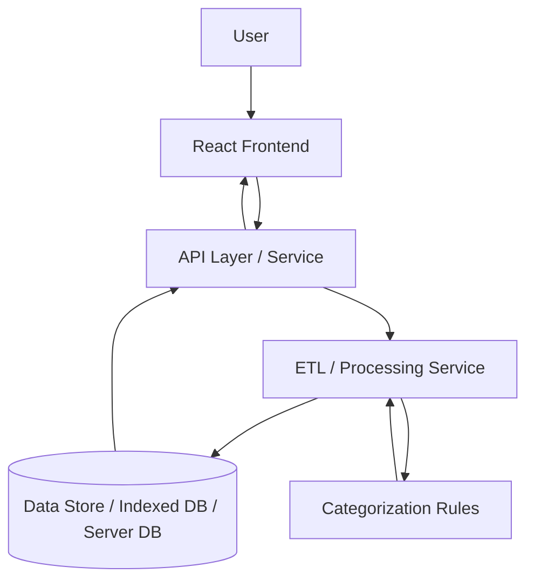
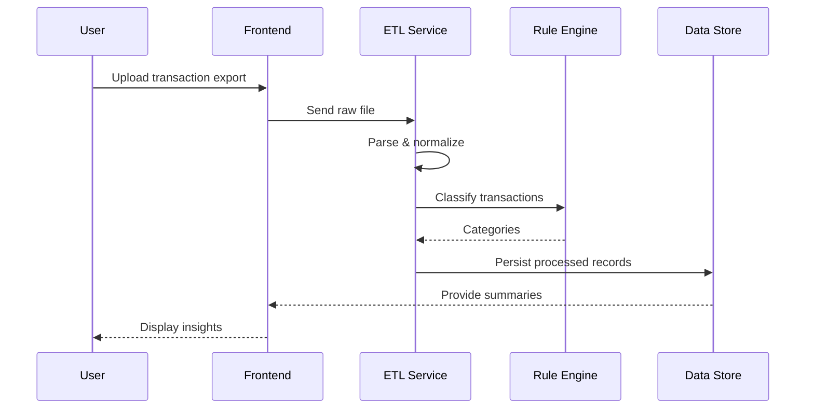

# CitiBank - FinChest

A production-minded personal finance dashboard and transaction analysis tool focused on clarity, reliability, and extensibility. FinChest helps users consolidate transaction data, categorize expenses, and explore insights while preserving a maintainable codebase suitable for production evolution.

## Overview

### Problem Statement
Personal finance data is often fragmented across accounts and formats. Users and organizations need reliable tooling to normalize transactions, derive actionable insights, and run repeatable analyses without sacrificing data privacy or consistency.

### Motivation
FinChest is designed as an engineering-focused solution to transaction consolidation and analysis: emphasize deterministic data processing, testable transformation pipelines, and clear boundaries between ingestion, storage, and presentation.

### Objectives
- Provide a robust pipeline for importing and normalizing transaction data.
- Surface meaningful expense categorization and trends.
- Maintain an architecture that supports growth: more data sources, higher volume, and stronger access controls.
- Demonstrate production-ready engineering practices in a portfolio project.

---

## Key Features

### Core Functionality
- Transaction ingestion and normalization from CSV/JSON exports.
- Rule-based and statistical expense categorization.
- Time-series summaries and trend visualizations.
- Queryable data model suitable for export or integration.

### Technical Highlights
- Deterministic ETL-style processing separated from UI concerns.
- Modular rule engine for categorization with fallback ML-friendly hooks.
- Frontend designed for progressive enhancement and accessibility.
- Emphasis on testability: units for parsers, transformers, and ranking logic.

---

## Architecture

### High-Level Architecture
FinChest follows a layered architecture that decouples ingestion, processing, storage, and presentation.



### Component Responsibilities
- **Frontend (React):** handles import UX, data visualization, and interactive queries.
- **API Layer:** validation, aggregation endpoints, and authentication stubs.
- **ETL/Processing Service:** parsers, normalizers, deduplication, and categorization pipelines.
- **Data Store:** local IndexedDB for single-user mode; swappable to a server-side database for multi-user deployments.
- **Rule Engine:** deterministic, auditable categorization steps with clear operator override.

### Data Flow
1. User uploads a transaction export (CSV/JSON) or connects an account adapter.
2. ETL parses and canonicalizes fields (date formats, amounts, merchant names).
3. Deduplication and normalization run, then categorization rules apply.
4. Processed records are stored; UI queries summarized endpoints for visuals.

---

## Tech Stack

| Category | Technologies |
|----------|--------------|
| Frontend | React, JavaScript (ES6+) |
| Build Tooling | Vite |
| Storage | IndexedDB (local), JSON export/import |
| Data Processing | Custom ETL modules (JS) |
| Linting / Quality | ESLint, Prettier |
| Testing | Jest (unit), Playwright / Cypress (e2e) |
| Version Control | Git + GitHub |
| Diagramming / Docs | Mermaid, Markdown |

### Why These Technologies
- **React:** supports component-driven interfaces and progressive enhancement for data-heavy UIs.
- **Vite:** provides a fast development experience and efficient production bundles.
- **IndexedDB:** pragmatic local store for offline-capable single-user workflows; easily replaced by a server DB if multi-user is required.
- **Jest:** fast unit testing for data transformation logic where determinism matters.

---

## System Design

### Design Principles
- **Determinism:** ETL outputs should be identical for identical inputs to support reproducible analyses.
- **Separation of Concerns:** parsing, normalization, categorization, and presentation are isolated.
- **Observability-ready:** structured logs and test hooks to enable future tracing and metrics.

### Scalability Considerations
- For small-scale (single-user) usage, client-side processing and IndexedDB suffice.
- For team or enterprise scale, move ETL to server-side jobs, introduce message queues, and add a scalable datastore with geospatial/time-series indexing.
- Categorization rules can be sharded or compiled into a ruleset service for centralized updates.

### Reliability Mechanisms
- Input validation and schema checks during ingestion.
- Idempotent processing to avoid duplicate records across re-imports.
- Unit and integration tests covering parsing and deduplication edge cases.

### Security Measures
- No sensitive account credentials are stored in the client; connectors should use OAuth flow in future server integrations.
- Strict input sanitization and CSV/JSON schema validation to prevent injection or malformed data issues.
- Principle of least privilege for any future backend service accounts.

### Performance Optimizations
- Batch processing of records to amortize parsing overhead.
- Incremental updates and pagination for UI queries to keep memory use predictable.
- Memoized transformation functions for repeated lookups.

### Engineering Trade-offs
- Client-side processing is fast to iterate and simplifies demos but limits throughput and centralized control.
- Prioritize deterministic, testable modules over premature optimization; optimize hotspots identified by profiling.

---

## Project Structure

```text
CitiBank-FinChest/
├── public/                 # Static assets
├── src/
│   ├── components/         # Reusable UI components
│   ├── pages/              # App pages and routes
│   ├── etl/                # Parsers, normalizers, deduplication
│   ├── services/           # API and processing orchestration
│   ├── data/               # Sample exports and fixtures
│   ├── utils/              # Helpers and validators
│   ├── App.jsx
│   └── main.jsx
├── tests/                  # Unit and e2e tests
├── .eslintrc.*
├── package.json
└── README.md
```

---

## Processing Sequence (Diagram)



---

## Getting Started

### Prerequisites
- Node.js 18+
- npm 9+

### Installation
```bash
git clone https://github.com/ShaikYasir/CitiBank-FinChest.git
cd CitiBank-FinChest
npm install
```

### Run Locally
```bash
npm run dev
```

### Production Build
```bash
npm run build
npm run preview
```

---

## Roadmap

- [ ] Add connectors for bank APIs via secure OAuth adapters.
- [ ] Server-side ETL option with job queue and monitoring.
- [ ] Expand automated test coverage and CI pipeline.
- [ ] Add role-based access and export controls for multi-user scenarios.

---

## Contribution Guidelines

Contributions are welcome. Open an issue for major changes and include context, expected behavior, and potential schema impacts.

For code contributions:
1. Fork the repo
2. Create a feature branch
3. Add tests for parsing/normalization where applicable
4. Submit a pull request with a clear description
